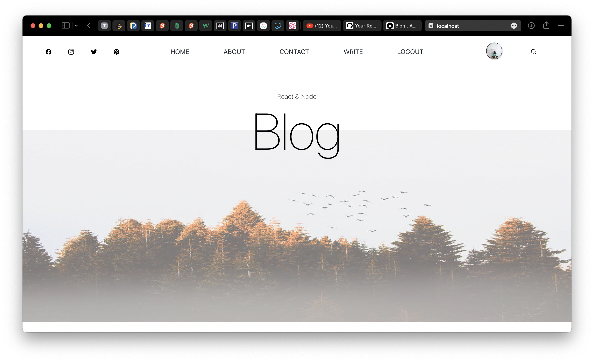

# Blog App UI in React

## Table of Content

- [Blog App UI in React](#blog-app-ui-in-react)
  - [Table of Content](#table-of-content)
  - [Demo Pictures](#demo-pictures)
    - [Home Page](#home-page)
  - [Folder Structure](#folder-structure)
  - [Libraries and Frameworks](#libraries-and-frameworks)
  - [Available Scripts](#available-scripts)
    - [`npm start`](#npm-start)
    - [`npm run build`](#npm-run-build)

## Demo Pictures

### Home Page



## Folder Structure

```
project
.
├── README.md
├── package-lock.json
├── package.json
└── src
    ├── App.css
    ├── App.js
    ├── assets
    ├── components
    │   ├── editpost
    │   ├── header
    │   ├── home
    │   ├── login
    │   ├── navbar
    │   ├── post
    │   ├── posts
    │   ├── profile
    │   └── sidebar
    ├── index.css
    ├── index.js
    └── logo.svg

12 directories, 8 files
```

## Libraries and Frameworks

| Title | Description                                       |
| ----- | ------------------------------------------------- |
| React | A JavaScript library for building user interfaces |

## Available Scripts

In the project directory, you can run:

### `npm start`

Runs the app in the development mode.\
Open [http://localhost:3000](http://localhost:3000) to view it in your browser.

The page will reload when you make changes.\
You may also see any lint errors in the console.

### `npm run build`

Builds the app for production to the `build` folder.\
It correctly bundles React in production mode and optimizes the build for the best performance.

The build is minified and the filenames include the hashes.\
Your app is ready to be deployed!

See the section about [deployment](https://facebook.github.io/create-react-app/docs/deployment) for more information.
